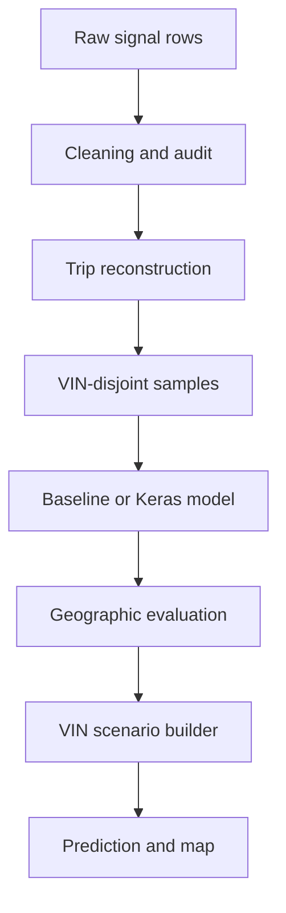
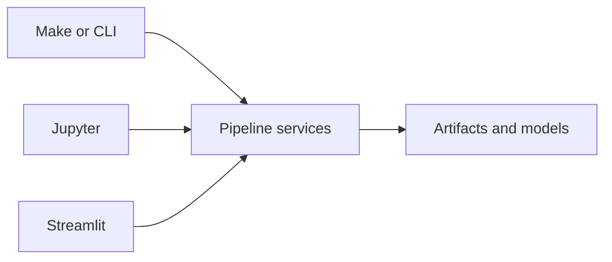
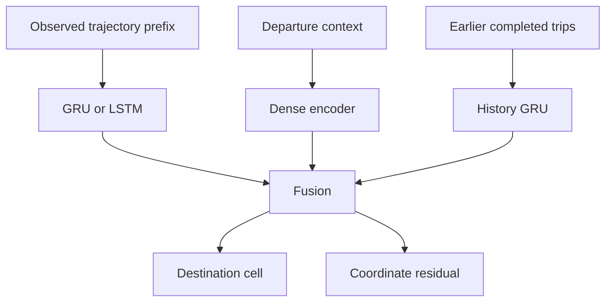

# Architecture and scientific contract

## Stage contracts

| Stage | Input | Output | Main safeguard |
| --- | --- | --- | --- |
| Cleaning | Long telemetry table | Canonical usable rows | Original data unchanged |
| Reconstruction | Start/end/scalar/array signals | Trips and points | Every discard audited |
| Dataset | Accepted trips | Prefix/history samples | Destination and future hidden |
| Split | VIN list | Train/validation/test VINs | Complete group disjointness |
| Model | Training samples | Ranked cells and coordinates | VIN never a feature |
| Evaluation | Untouched predictions | Geographic/ranking metrics | Undefined remains undefined |
| VIN scenario | VIN, reference trip, editable known inputs | One exact feature row + provenance | History ends before departure; actual is comparison-only |
| Map | Trip and prediction | Trajectory/candidates/actual layers | Actual and predicted are distinct |

## Entry-point architecture

The CLI, Makefile, notebook and Streamlit application all call the same
`vehicle_destination.pipeline` and `vehicle_destination.inference` services.
They do not contain parallel implementations of cleaning, feature engineering,
training or prediction.

`VinInferenceRequest` is the single scenario contract. It validates all editable
inputs, produces a deterministic request hash, and records whether departure,
origin, prefix and history were inherited or overridden. The selected VIN is
used to locate eligible history and the saved split only; it is never added to
`FEATURE_COLUMNS`.

## Baseline

The baseline trains a random-forest destination-cell classifier and an
extra-trees latitude/longitude regressor on departure-time, partial-trajectory,
calendar, origin, and earlier-history features. It is the default because it is
fast, inspectable, and reliable on small execution fixtures.

## Sequence model

The classification vocabulary is learned from training VINs only. Unknown
validation/test cells receive zero classification sample weight while their
coordinate errors remain evaluable.
